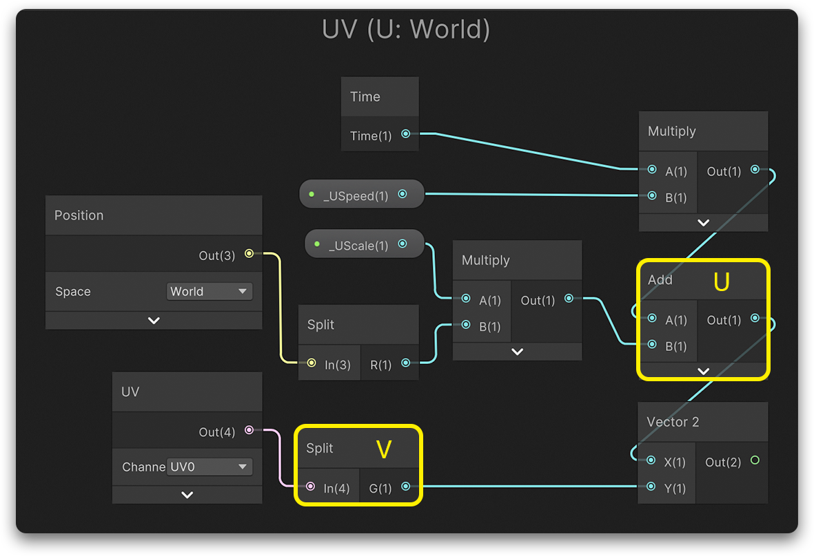
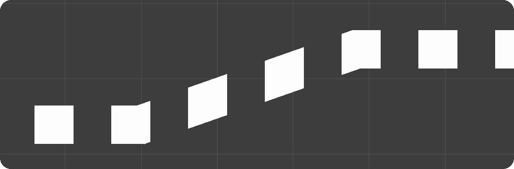
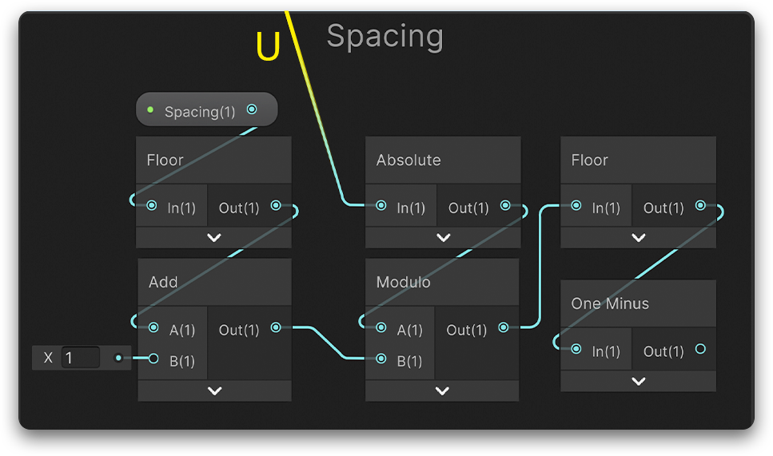
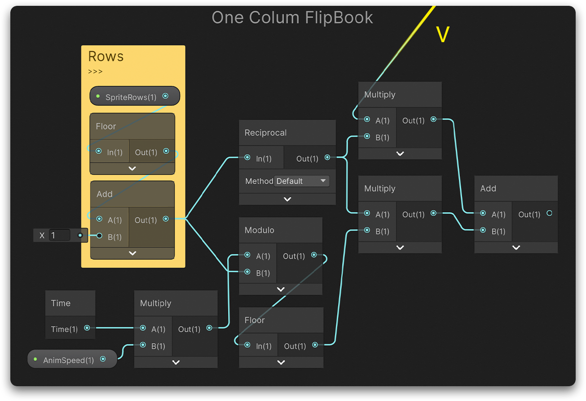
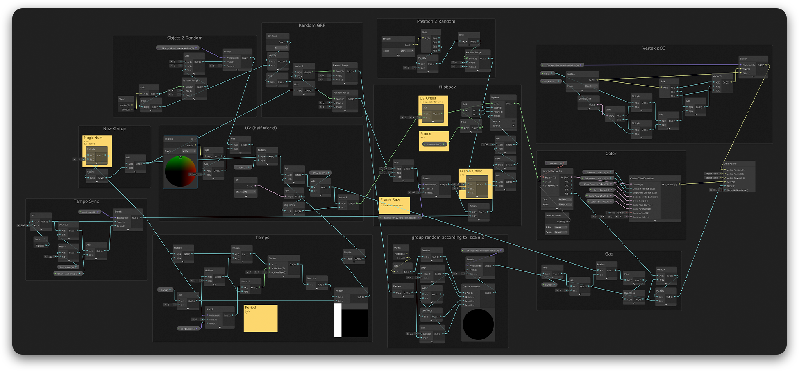

<h1>ShaderGraph实现2D人群动画</h1>

> 通过 ***uv*** 结合帧动画等方式实现状态不一的人群，例如高低不同，颜色不同，帧动画播放速度不同，人群间隔不同等，并且可以通过 linerenderer 来规划路径。
> 局限：在平面上效果最佳，且不能有太大的倾斜角度

<ul>
    <li><a href="#introMethod">实现方式</a><ul><li><a href="#uvx">uv.x设置</a></li><li><a href="#spacing">间隔设置</a></li><li><a href="#vanim">sprite sheet设置</a></li></ul></li>
	<li><a href="#extend">拓展</a></li>
</ul>

> 用以前画的一段序列动画来做演示，颜色随机和高低以及速度等没有设置很明显。

  

<h2 id="introMethod"><em>实现方式：</em></h2>

> 最重要的一点是利用世界坐标x的值来作为uv.x值。
> 其余效果大致从这展开。

1. 
将世界坐标的x轴作为uv.x，uv.y暂时先保持不变。这样就可以做到随意改变宽度却不影响列数。

   因为uv.y不变所以可以使用 linerenderer 来做上下坡的效果。

  

  

2. 
对上一步得到的uv.x取模后作为透明通道就可以用来表现间隔（记得取绝对值）

  

3. 
添加序列动画需要对uv.y进行修改。该方法建议sprite sheet的行数为1（行数不为1的话间隔要是2的倍数才行）。可以通过取模等简单计算得到序列帧动画。

  

<h2 id="extend"><em>拓展：</em></h2>

用实现方法1. 中得到的u取整做随机再通过lerp可以对该shader中的各种值做随机，从而模拟人群（或物体）的随机感。
因为u是取整后再做随机，所以能保证每一列各自分配到一个随机值。

例如：

- 在v做各种计算前就可以做随机高度缩放（缩放的程度取决于sprite sheet中每一帧上方的空白有多少）

- sprite sheet可以用这个添加一个偏移使得播放顺序以及速度不一致

- 同理间隔和颜色也可以随机

- 每个实例还可以根据世界位置信息来做偏移和随机。可以使用object position，不过在使用linerenderer的时候不可以，因为其object position为世界坐标原点 (0, 0, 0) 。

  在使用linerenderer时可以直接使用world position 的z来做偏移或随机，前提是这些物体和z轴同一方向（有时可能会出现闪烁，尤其是在相机改变焦距或者发生z方向位移时。解决方法：floor或ceil(a*positionWS.z) 

- 使用linerenderer的好处是可以编辑路径，且操作方便，但是处理随机不太方便。

  可以根据需求做一个简单的模型，并使用vertex color来做顶点位移的遮罩。这样就可以实现简单的上下坡，甚至朝向与z轴偏一些也有不错的效果。
  
- 最后整合后的shadergraph：

  

